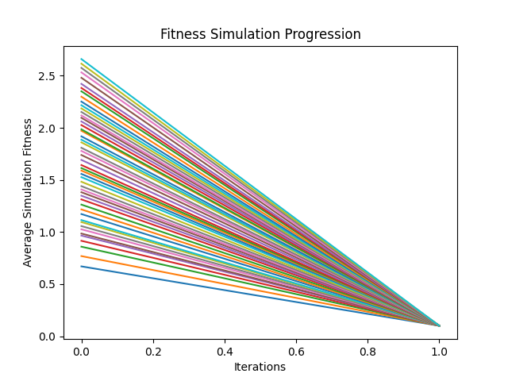
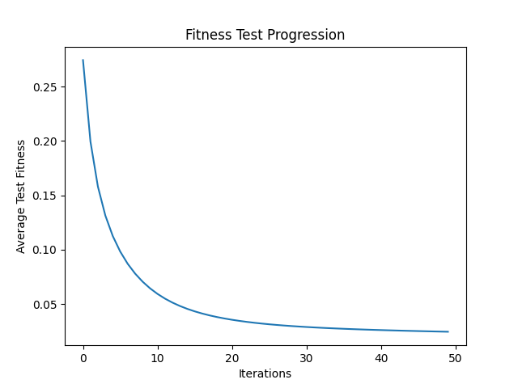

# Simülasyon Fitness

Bu, algoritmanın kendi içinde bir döngüde veya iterasyonda nasıl performans gösterdiğini ölçmek için kullanılır.
Aalgoritmanın her bir iterasyonunda veya jenerasyonunda elde edilen fitness değerlerinin ortalamasıdır.
Bu, algoritmanın zamanla nasıl geliştiğini veya değiştiğini görmek için kullanılır.

# Test Fitness

Bu, algoritmanın performansını ölçmek için kullanılır.
Test fitness değeri, algoritmanın belirli bir görevi ne kadar iyi gerçekleştirebildiğini gösterir.

