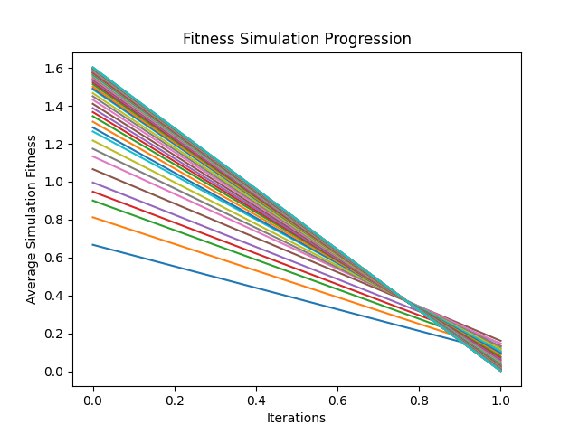
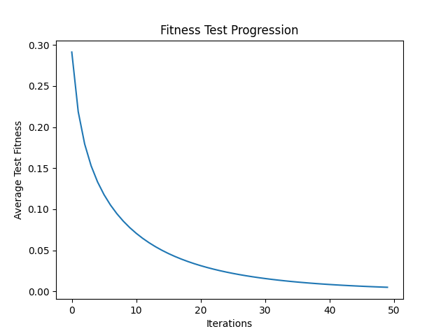

# Simülasyon Fitness

Bu, algoritmanın kendi içinde bir döngüde veya iterasyonda nasıl performans gösterdiğini ölçmek için kullanılır.
Aalgoritmanın her bir iterasyonunda veya jenerasyonunda elde edilen fitness değerlerinin ortalamasıdır.
Bu, algoritmanın zamanla nasıl geliştiğini veya değiştiğini görmek için kullanılır.

|  |  |
|:---:|:---:|
| mutasyon öncesi  | mutasyon oranını % 10 |

Bu veri seti, algoritmanın kendi içindeki simülasyon sırasında elde edilen fitness değerlerinin ortalamasını içerir.
Her bir değer, algoritmanın belirli bir simülasyon iterasyonunda ne kadar iyi performans gösterdiğini gösterir.
Gözlemlediğimiz değerlerin zamanla artması, algoritmanın kendi içinde optimize olduğunu ve daha iyi performans gösterdiğini gösterir. Daha yüksek ortalama fitness değerleri, algoritmanın optimize edilmesi ve geliştirilmesi sürecinde ilerleme kaydettiğini gösterir

# Test Fitness

Bu, algoritmanın performansını ölçmek için kullanılır.
Test fitness değeri, algoritmanın belirli bir görevi ne kadar iyi gerçekleştirebildiğini gösterir.

|  |  |
|:---:|:---:|
| mutasyon öncesi  | mutasyon oranını % 10 |

Bu veri seti, belirli bir test senaryosunda algoritmanın performansını göstermektedir.
Her bir değer, test senaryosundaki bir iterasyonun sonunda elde edilen ortalama fitness değerini temsil etmektedir.
Gözlemlediğimiz değerlerin zamanla azalması, algoritmanın test senaryosunda daha iyi performans gösterdiğini gösterebilir. Daha düşük ortalama fitness değerleri, test senaryosuna daha iyi uyum sağladığına işaret eder.
